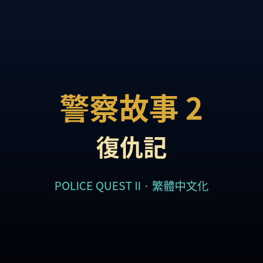
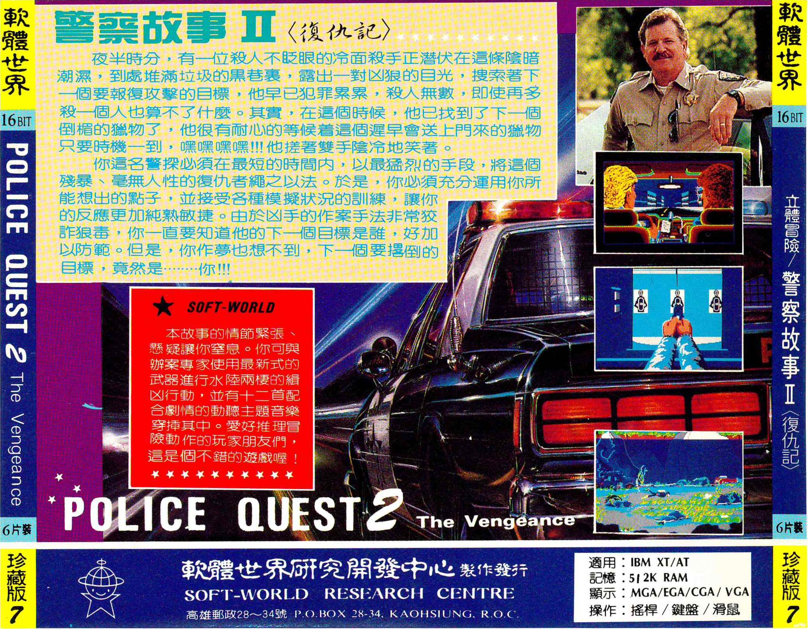
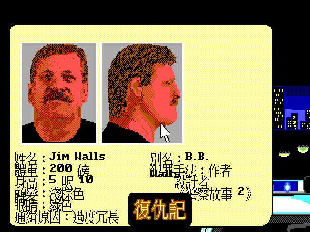
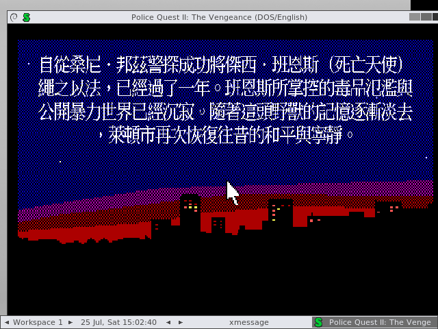
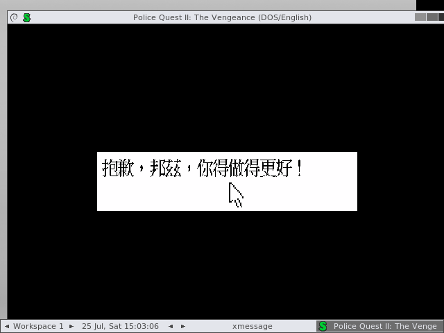
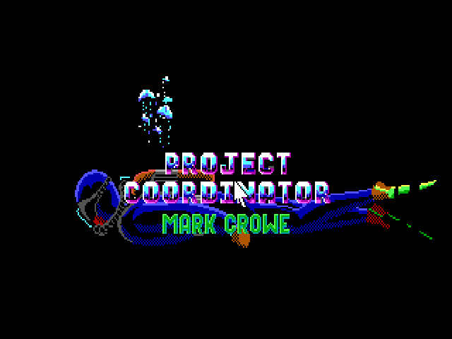
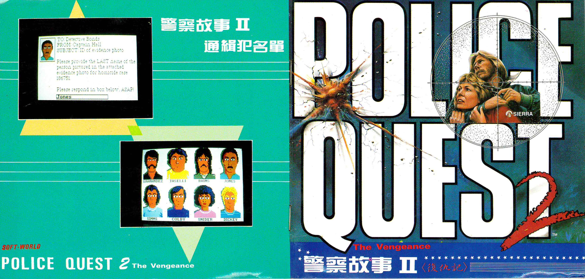

# 警察故事 2《復仇記》繁體中文化



> **Police Quest II: The Vengeance** 是 Sierra 於 1980 年代末推出的警察辦案冒險遊戲。本專案為 DOS SCI0/EGA 版本製作繁體中文化，讓 Sonny Bonds 的案件、證物、通訊與失敗訊息，都能以熟悉的中文重新閱讀。

## 遊戲介紹

### 夜半巷弄裡的復仇者

中文說明書的前言如此描寫這起案件：

> 夜半時分，有一位殺人不眨眼的冷面殺手，正潛伏在這條陰暗潮濕、到處堆滿垃圾的黑巷裡。他露出一對凶狠的目光，搜尋著下一個要報復攻擊的目標。這名罪犯早已犯案累累、殺人無數，即使再多殺一個人，也算不了什麼。
>
> 警探必須在最短的時間內，以最猛烈的手段，將這個殘暴、毫無人性的復仇者繩之以法。你得充分運用所有能想出的辦法，並接受各種模擬狀況的訓練，讓反應更加純熟敏捷。由於兇手的作案手法非常狡詐狠毒，你必須設法掌握他的下一個目標，好加以防範——然而，你作夢也想不到，下一個要遭到攻擊的目標，竟然是……**你！**

這不是單純的點擊尋寶遊戲。你扮演的是一名必須遵守程序的警察：觀察現場、調查證物、辨認嫌犯、正確使用裝備，並在緊張時刻做出合乎訓練的決定。遊戲會記住你的疏忽；闖紅燈、遺失證物、拔槍時機錯誤，甚至一個看似無關緊要的選擇，都可能讓案件走向截然不同的結局。

### Sonny Bonds 的回歸

本作延續前作主角 Sonny Bonds 的警察生涯。Lytton 市表面上平靜，暗地裡卻有綁架、槍擊、毒品、勒索與報復案件接連發生。你會在警局、街道、機場、商場、海岸與下水道之間奔波，閱讀案件檔案、接受同僚指示，逐步拼起兇手留下的線索。

遊戲的魅力在於「像警察一樣思考」：

- 先閱讀案件資料，再決定下一步行動。
- 依照警察程序處理交通、盤問、搜查與證物。
- 記住人物姓名、地點與細節，必要時回頭交叉比對。
- 善用 `look`、`ask`、`use`、`get` 等指令，讓文字冒險成為真正的辦案工具。
- 失敗並不只是 Game Over；每個錯誤結局都像一份反面教材，提醒你下次更謹慎。



上圖為保存下來的中文說明書劇情頁；當年的宣傳文案把本作形容為「立體冒險／警察故事」，並特別強調模擬訓練、辦案推理與緊張的追捕過程。

## 中文化畫面

### 案件資料：通緝犯名單

中文化不只翻譯對話，也包含案件檔案、人物資料、物品名稱、地點、選單、動態訊息與失敗結局。以下畫面是遊戲中整理嫌犯資料的案件檔案：



### 開場旁白與案件氣氛

SCI0/EGA 原始畫面保留了強烈的 16 色像素風格；中文化補上 Big5 字型與執行期文字替換，使開場旁白能直接在遊戲畫面中閱讀：



### 文字指令回應

本作的核心是輸入文字指令。中文化後，遊戲的回應、提示與失敗訊息也會使用繁體中文；下圖是正常流程測試中輸入錯誤操作後得到的中文回應：



### 原汁原味的復古演出

片尾製作人員、夜景、警車與案件畫面仍保留原始 EGA 美術，翻譯則集中在真正需要閱讀與操作的文字內容，讓整體既有中文可讀性，也維持 1980 年代 Sierra 冒險遊戲的味道。





## 推廣影片

這支約 30 秒的無音樂字幕短片，從中文說明書的案件前言開始，接著展示通緝犯資料、中文開場旁白、文字指令回應與復古 EGA 畫面：

[](docs/promo/pq2-cht-promo.mp4)

▶️ [下載／觀看推廣影片 `pq2-cht-promo.mp4`](docs/promo/pq2-cht-promo.mp4)

影片由 [`tools/build_promo_video.sh`](tools/build_promo_video.sh) 使用 repository 內的公開截圖重新產生，不包含原始遊戲資源或遊戲音樂。

## 本專案完成內容

| 項目 | 狀態 |
| --- | --- |
| SCI0/EGA Big5 繪字 | ✅ 已完成 |
| 遊戲選單、對話與案件資料 | ✅ 已完成 |
| script 內嵌文字與動態訊息 | ✅ 已完成 |
| PQ2 標題「復仇記」疊圖 | ✅ 已完成 |
| 中文 parser 與正常流程驗收 | ✅ 已完成 |
| Windows / Linux / macOS 交付包 | ✅ 已完成 |

目前共有 **3,936 / 3,956 個候選文字鍵完成翻譯**；剩餘 20 個為遊戲內部控制碼、編碼片段或不可見鍵值，保留原文以避免破壞腳本。中文遊戲標題使用 Big5 圖像疊加，顯示為「復仇記」。

## 下載與安裝

本專案採 **patch-only** 發佈，不包含 Sierra 原始遊戲資源、DOS 執行檔或 MT-32 ROM。請先準備自己合法取得的 `Police Quest II` DOS 遊戲資料，再使用下列其中一種方式：

### Windows

下載 `PQ2-CHT-win64.zip`，解壓縮後把原始遊戲檔案放入 `game/` 資料夾，再執行包內的 ScummVM。若已有自己的 ScummVM，也可以使用 `PQ2-CHT-win64-patch.zip` 中的中文資料與執行檔。

### Linux

下載 `PQ2-CHT-full-x86_64.AppImage` 或 `PQ2-CHT-patch-x86_64.AppImage`，加入執行權限後啟動：

```bash
chmod +x PQ2-CHT-*.AppImage
./PQ2-CHT-full-x86_64.AppImage
```

`full` 包含本專案可分發的引擎與中文資料，但仍需要玩家自行提供原始遊戲資料；`patch` 則只提供引擎與中文化檔案。

### macOS

下載 `PQ2-CHT-macos-universal.tar.gz` 或 `PQ2-CHT-macos-universal.dmg`。macOS 版本由 GitHub Actions 使用 `arm64 + x86_64` 合併編譯，Apple Silicon 與 Intel Mac 均可使用。

macOS 產物：[GitHub Actions build 30163658485](https://github.com/wicanr2/police_quest2-cht/actions/runs/30163658485)

## 原始碼與重建

公開中文資料位於 [`dist-cht/`](dist-cht/)：

- `translation.tsv`：繁體中文翻譯表
- `qfg1_big5.fnt`：SCI Big5 字型
- `qfg1_big5_hi.fnt`：高解析度 Big5 字型
- `pq2_title.ovl`：PQ2「復仇記」標題疊圖

重新產生翻譯資料：

```bash
bash tools/build_translation.sh
```

這會合併 `translation/full_skeleton.tsv` 與數字排序的 `translation/batch/*.tsv`，產生 `game/translation.tsv`、Big5 字型與 `game/pq2_title.ovl`。引擎 patch、Docker 驗收與三平台打包流程詳見 [`HANDOFF.md`](HANDOFF.md)、[`WORKLIST.md`](WORKLIST.md) 與 [`CONTEXT.md`](CONTEXT.md)。

## 授權與資料來源

- ScummVM 引擎依其原有授權條款使用；本專案只提供必要的中文化 patch、工具與公開中文資料。
- 原始遊戲資源、DOS 執行檔與 MT-32 ROM 不在本 repository，也不隨交付包分發。
- 說明書圖片來自本地保存的《警察故事 II〈復仇記〉》中文說明書掃描，僅作為遊戲歷史與中文化介紹用途。

## 專案連結

- GitHub：[wicanr2/police-quest2-cht](https://github.com/wicanr2/police-quest2-cht)
- macOS universal build：[GitHub Actions](https://github.com/wicanr2/police-quest2-cht/actions/runs/30163658485)
